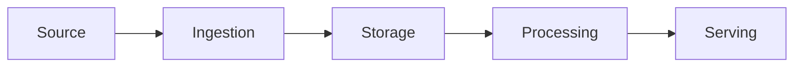

<!--
  새 글: 이 파일을 src/content/blog/<slug>.md 로 복사해서 시작한다.
  구조는 CLAUDE.md §7을 따르되 기계적으로 채우지 않는다. 필요 없는 섹션은 지운다.
  작성자가 실제로 겪지 않은 경험은 쓰지 않는다 (CLAUDE.md §13).
-->

## 오프닝

<!-- 실제 질문, 경험, 문제, 깨달음으로 시작한다. "X는 ~하는 기술이다"로 시작하지 않는다. -->

## 문제

<!-- 이 기술이 등장하게 된 문제. 이전 방식의 한계. -->

## Mental Model

<!-- 독자가 가져갈 단순한 개념 모델 하나. 다이어그램 권장. -->

## 아키텍처

<!-- 컴포넌트 → 책임 → 상호작용. 나열하지 않는다. -->

## 엔지니어링 관점

<!-- 과거 경험과의 비교. 비유가 어디서 깨지는지도 명시한다. -->

## 직접 해본 것 / 문서에 따르면

<!-- 구분해서 쓴다.
     - 직접 검증한 것: 실제로 실행한 코드, 명령, 로그, 실험
     - 문서/출처 기준: 공식 문서 링크와 버전/날짜
     실제로 하지 않은 테스트를 했다고 쓰지 않는다. -->

## 이번에 달라진 이해

<!-- 공부 전 오해와 공부 후 이해. "중요한 기술이다" 같은 일반적 결론은 쓰지 않는다. -->

## 다음 질문

<!-- 이 글이 자연스럽게 만들어 낸 다음 질문. 다음 주 글로 이어진다. -->
